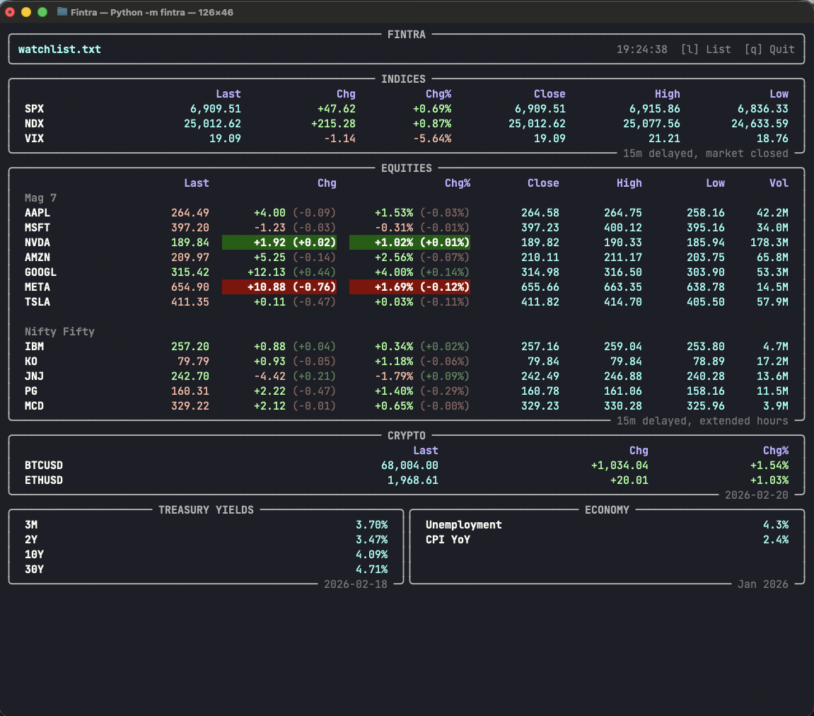

# Fintra — Terminal Market Dashboard



A real-time terminal dashboard for equities, crypto, indices, and economic data. Built with the [Massive.com](https://massive.com) (Polygon.io) API and rendered with [Rich](https://github.com/Textualize/rich).

Stocks and indices stream per-second via WebSocket on Starter+ plans. Crypto polls on a rate-limited interval. Treasury yields and economic indicators load in the background on startup.

Data freshness depends on your plan: real-time (Advanced), 15-minute delayed (Starter), or end-of-day (Basic/Free).

## Setup

```bash
git clone <repo-url> && cd Fintra
bash setup.sh
```

Create a `.env` file with your API key (see `.env.example`):

```
MASSIVE_API_KEY=your_key_here
```

Then run:

```bash
source venv/bin/activate
python -m fintra
```

The dashboard appears immediately. Data populates in the background as API calls complete.

On first run, Fintra probes your API key to detect plan entitlements (cached in `.plans.json`).

## Massive.com Plans

Fintra auto-detects your plan and adapts its behavior:

| Data | Basic (Free) | Starter ($29/mo) | Advanced |
|------|-------------|-------------------|----------|
| Equities | REST daily aggs, end-of-day | REST snapshots + WS streaming, 15m delayed | Real-time |
| Indices | REST daily aggs, end-of-day | REST snapshots + WS streaming, 15m delayed | Real-time |
| Crypto | REST daily aggs, end-of-day (5 calls/min) | REST snapshots, real-time | Real-time |
| Treasury / Economy | REST (5 calls/min, spaced 15s apart) | Same | Same |

Lower plans work — the dashboard gracefully handles missing entitlements and rate limits.

## Configuration

### config.ini

```ini
[dashboard]
# How often stock/index REST data refreshes (WS streams independently)
refresh_interval = 10s    # 10s, 1m, 5m, 15m, 1h

# How often economy data refreshes (changes at most daily)
economy_interval = 1d     # 1h, 6h, 1d

# Columns per section (comma-separated). Symbol is always shown first.
# Equities: last, chg, chg%, open_close, open, high, low, vol, mktcap, ytd%
equities_columns = last, chg, chg%, open_close, high, low, vol

# Indices: last, chg, chg%, open_close, open, high, low, ytd%
indices_columns = last, chg, chg%, open_close, high, low

# Crypto: last, chg, chg%
crypto_columns = last, chg, chg%
```

Time units: `s` (seconds), `m` (minutes), `h` (hours), `d` (days).

Column notes:
- The symbol column is always present as the first column and cannot be removed
- `open_close` toggles between Open and Close based on market status

### Watchlists

Place `.txt` files in `watchlists/`. One ticker per line, organized by section. Press `l` to cycle between watchlists at runtime.

Within `[equities]`, use `## Group Name` headers to create visual sub-groups:

```
[equities]
## Mag 7
AAPL
MSFT
NVDA
AMZN
GOOGL
META
TSLA

## Nifty Fifty
IBM
KO
JNJ
PG
MCD

[crypto]
X:BTCUSD
X:ETHUSD

[indices]
I:SPX
I:DJA
I:NDX
I:VIX

[treasury]
3M
2Y
10Y
30Y

[economy]
unemployment
cpi_yoy
```

**Ticker format:**
- Equities: bare symbol (`AAPL`, `MSFT`, `NVDA`)
- Crypto: `X:` prefix (`X:BTCUSD`, `X:ETHUSD`)
- Indices: `I:` prefix (`I:SPX`, `I:VIX`, `I:DJI`, `I:NDX`)
- Treasury: maturity label (`1M`, `3M`, `6M`, `1Y`, `2Y`, `5Y`, `10Y`, `30Y`)
- Economy: indicator key (`unemployment`, `participation`, `avg_hourly_wage`, `cpi`, `core_cpi`)
- Blank lines and `#` comments are ignored

**Crypto rate limiting:** The free currencies plan allows 5 API calls/min. Fintra automatically throttles crypto polling based on ticker count (minimum 15s between refreshes, ~12s per ticker). Adding more than 5 crypto tickers will increase the polling interval accordingly.

## Dashboard Layout

Sections are displayed in this order:

| Section | Subtitle |
|---------|----------|
| **Indices** | Freshness + "market closed" when applicable |
| **Equities** | Freshness + "market closed" when applicable |
| **Crypto** | Starter: "real-time, polled Xs ago"; Basic: data date |
| **Treasury Yields** | Data date (YYYY-MM-DD) |
| **Economy** | Data date (Mon YYYY) |

Each section's subtitle shows data freshness and market status. Prices, volumes, yields, and economy values are displayed in cyan; changes are green (positive) or red (negative).

## Controls

| Key | Action |
|-----|--------|
| `l` | Cycle watchlists |
| `q` | Quit cleanly |
| `Ctrl+C` | Quit (fallback) |

## Architecture

Python package (`fintra/`) with 8 core modules:

| Module | Purpose |
|--------|---------|
| `constants.py` | Yield/economy fields, column definitions, paths |
| `config.py` | Config parsing (config.ini, watchlist.txt) |
| `state.py` | `DashboardState` dataclass (shared mutable state) |
| `plans.py` | API plan detection and caching |
| `provider.py` | `MassiveProvider` — sole module importing from the Massive SDK |
| `formatting.py` | Price/change/volume formatting helpers |
| `data.py` | Data fetching orchestration (market, crypto, economy, caching) |
| `websocket.py` | WebSocket streaming for real-time updates |
| `ui.py` | Rich table/panel builders, layout, key listener |
| `app.py` | Main orchestration loop |

All Massive SDK access is isolated in `provider.py`. Every other module works with plain Python dicts — no SDK types leak beyond the provider boundary.

How it works:

1. Dashboard renders immediately with blank values
2. `MassiveProvider` created with API key; plan entitlements detected (or loaded from cache)
3. Background threads fetch REST data via provider methods (snapshots, aggs, economy)
4. WebSocket feeds start via `provider.create_ws_feed()` for entitled asset classes
5. Main loop renders the Rich layout at 2fps from shared `DashboardState`
6. REST continues polling on `refresh_interval` as a safety net alongside WS
7. Delayed feeds continue 15 minutes after market close; real-time feeds stop immediately
8. Crypto: Starter plan polls 24/7; Basic plan stops when US market closes (end-of-day data only)

## Troubleshooting

- **Crypto flickering or blank:** Rate limit exceeded. Reduce crypto tickers or increase `refresh_interval`.
- **Economy sections showing "loading..." forever:** Economy endpoints may be rate-limited. They space calls 15s apart and will populate within ~45s of startup if the API allows.
- **"Rate limited" in header:** Fintra auto-backs off to 4x the configured interval (max 120s) and recovers when limits clear.
- **Terminal broken after exit:** Should not happen (terminal settings are saved/restored), but run `reset` if it does.

---

Built with [Claude Code](https://claude.ai/claude-code).
